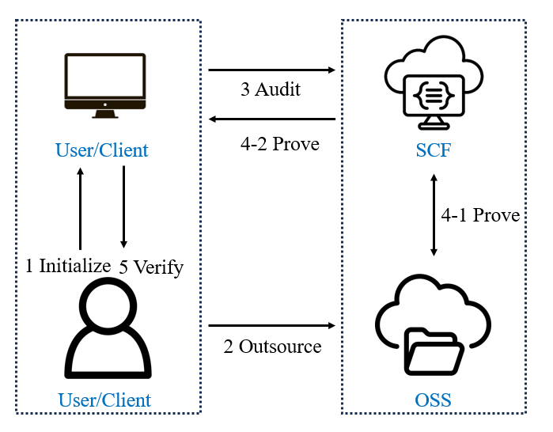

# Cloud Storage Auditing System Using Serverless ComputingII

Cloud storage, as a modern infrastructure, significantly simplifies the development of application systems, yet it introduces data security challenges. While existing cloud storage audit solutions have made theoretical advancements, they still face issues of high cost and inefficiency in real-world use. 

This project proposes a cloud storage auditing system based on Serverless Cloud Function (SCF), improving efficiency over current solutions. It enhances the practicality of cloud storage auditing through three key areas:
1. **Improved Operational Efficiency:** Using parallel data transmission based on multiple TCP connections.
2. **Cost Reduction:** A method to maximize cloud resource utilization while reducing SCF execution time.
3. **Automated Deployment:** A system to streamline cloud service deployment, increasing usability.

Experimental results demonstrate the system's strong performance in large-scale data auditing tasks. Compared to existing solutions, audit time is reduced to just 10%, while audit cost is only 5% of the original. This solution provides robust support for the practical application of unified cloud storage auditing, with valuable insights for serverless computing applications.

SCF, as an interface for object storage, involves three key components: users, storage services, and computing services. The SCF-based cloud storage auditing system follows these steps:

<div align="center">
    
</div>

## Build

This project is developed using **Java 1.8.0_202** with the **Tencent Cloud SDK** and compiled via **IntelliJ IDEA** and **Maven**. The project dependencies, including different versions of the Tencent Cloud SDK, can be found in the `pom.xml` file.

Please configure the **Properties** file to enable access to OSS, SCF services, and to specify the location for intermediate audit files.

You can also package the project into a JAR file for usage. In this case, place the **Properties** file in the same directory as the JAR file and run the following command to execute:

```bash
java -cp TPDSInSCF-1.0-SNAPSHOT_Benchmark-jar-with-dependencies.jar com.fchen_group.TPDSInScf.Run.Client


## Usage

1. **Project Setup:** Import the project into IntelliJ IDEA, which will automatically resolve dependencies specified in `pom.xml`. Ensure the correct mirror source is set to download these dependencies smoothly.
2. **Cloud Service Setup:** Prepare cloud object storage and SCF services on Tencent Cloud (or other providers). Ensure these services are activated, as the project packages and deploys itself. You only need to configure the **Properties** file.
3. **Properties Configuration:** 
    - **Cloud Configuration:** Provide your cloud credentials for access.
    - **Operation Configuration:** Set the Maven path and a temporary space for system intermediate files. These files can be deleted after execution. Specify the local path for the files you wish to audit.
    - **Default Parameters:** These are preset to ensure efficient system performance on the cloud and generally don't need modification.

## Contributing

Feel free to test and explore our auditing system. We welcome collaboration and feedback!
